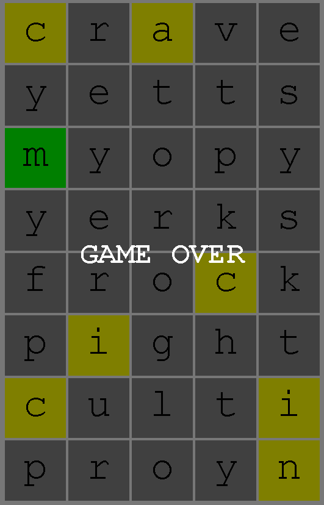
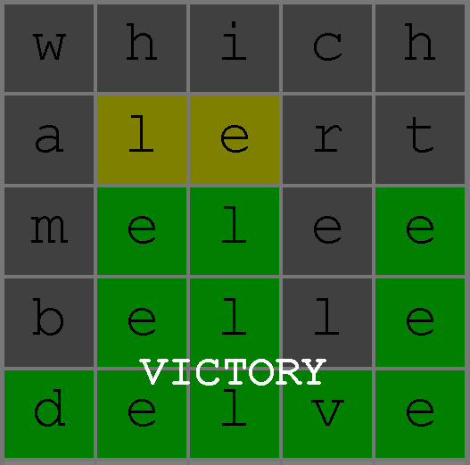
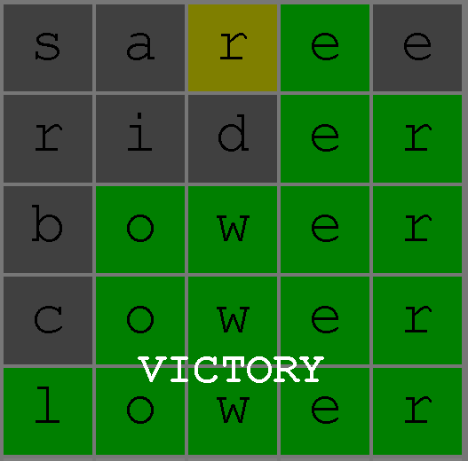
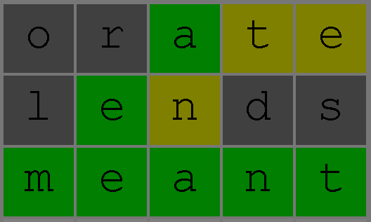

# Wordle - Semester assignment 1


In this assignment you will implement **Wordle**. In this game the goal is to guess a hidden 5 letter word. For each guess you receive information about if the letters used where correct and in the correct position. For each guess the letters will be given a color:
 * Green: The letter in this position is matching with the secret word
 * Yellow: The letter exist in the secret word, but not in this position.  
 * Gray: The letter is not in the word (at least after removing one copy for each tile already colored Green or Yellow)

The example on the Right shows a game in progress where the word to guess was *Sunny*.
When guessing a word it has to be a word from the English dictionary.
It is quite hard to guess a word if the secret word is something you never heard of, therefore the answer will be a relatively common word.
Wordle has 2 lists of words, one is all the words in the English dictionary, the other is the common words that can be the answer.

Your job will be to finish the implementation and implement an AI which can play the game.

To get a feel for the game you can play it here: https://wordlegame.org/ 

All code you submit will be evaluated on five points:
 - **Functional correctness**. Does the program do what it is supposed to do?
  - **Quality of AI**. How well can your AI play the game?
 - **Runtime**. Have you found an efficient solution to the program?
 - **Runtime analysis**. For each method you code you will need to add a comment about which Big-O runtime it has.
 - **Code quality**. Is you code readable and maintainable?

**IMPORTANT**: When implementing the code you must give a runtime analysis in [svar.md](svar.md).

 <br clear="right"/>
 
## Overview
This program uses the Model-View-Controller design pattern similar to that of Tetris from INF101.

The most important classes of this program are:
 - `WordleCharacter` represents a single letter in a guess word. It has two field variables:
   - `letter`: the letter the user has entered/written
   - `answerType`: CORRECT, WRONG_POSITION, WRONG or BLANK. This is what informs the user of whether their guess was good or not.
 - `WordleWord` represents a guess word. It is an Iterable of `WordleCharacter`. It is composed of 5 characters.
 - `WordleAnswer` is the class that contains the secret word that the user needs to guess.
 - `WordleWordList` is the class that contains all the words that the user can choose and all the words that can be the answer.

# Part 1 - Finish the game
The program for Wordle is not currently functional. It is missing one crucial method. 

## Task 1 - matchWord
What is missing is to implement the method that checks the guess word and gives feedback on which letters where correct.

**TODO: Your job is to implement `WordleAnswer::matchWord`.**

This method takes in a `WordleWord` object which is the word the user has guessed. It should return a new `WordleWord` object which has feedback on the guess, i.e. CORRECT, WRONG_POSITION or WRONG.

The rules as stated above is very clear when the word you guess contain 5 different letters. For instance, if the answer word is **abide** and the user guessed **adept** the feedback should be:


 - `a`: CORRECT
 - `d`: WRONG_POSITION
 - `e`: WRONG_POSITION
 - `p`: WRONG
 - `t`: WRONG

If the word you guess or the answer contains multiple letters of same type you must first color all green tiles, then among the ones not colored green you color yellow tiles starting from the left. If the number of tiles colored yellow or green is equal to the number of times the letter occur in the answer, the remaining occurrences in the guess will be colored grey.

✅ Run `WordleAnswerTest.java` to see if your implementation is correct. <br></br>
You should now be able to play the game by running `WordleMain.java`.

**TODO: analyze the runtime of `WordleAnswer::matchWord` and write your answer in [svar.md](svar.md).**

# Part 2 - Artifical Intelligence 
Now that we have a functional game it is time to create some players which are better than a human.

## RandomStrategy



Now that we have a functional game we want to implement an AI to play the game for us.
We already have an one AI: [RandomStrategy](./src/main/java/no/uib/inf102/wordle/controller/AI/RandomStrategy.java).
To use it we must switch out the controller class in `WordleMain.java`. 
Comment out `WordleHumanController` and add `WordleAIController`.

```java
public static void main(String[] args) {
    WordleBoard board = new WordleBoard(8, 5);
    WordleModel model = new WordleModel(board);
    WordleView view = new WordleView(model);
    //new WordleHumanController(model, view);
    new WordleAIController(model, view);
    ...
}
```

The random strategy simply guesses a random word every time, until it finds the secret word, disregarding the feedback it receives. This is a very bad strategy and most times you get GAME OVER instead of VICTORY.

Even though there was no plan to the guesses in the picture to the right we can figure out that the word probably was "manic".
If the AI kept the information that was obtained and only guessed words that fit with all the previous answers it would do much better.

**In the remaining tasks we will create more intelligent solutions.**

 <br clear="right"/>
 
## Task 2 - EliminateStrategy


This strategy seeks to eliminate all non possible words based on the feedback we get from our previous guesses. For the purposes of this strategy we see it as useless to guess a word that contains letters that is not in the secret word.

In order to improve the AI you need to make use of the information you get when you make a guess. The way to do this is to look through all the possible words an answer can be and eliminate the ones that does not match with the feedback you were given.

**TODO: Implement WordleWordList::eliminateWords.**

Hint: here it will be important to know which methods exist in the important classes mentioned in task 1

Once you get the tests for EliminateWords in WordleWordListTest to work you are ready to test your AI.
WordleMain runs one game and displays the result in a graphical user interface.
Currently the RandomStrategy AI is used, you will have to edit `WordleAIController` to register your new AI as the one to be used

```java
//this.AI = new RandomStrategy();
this.AI = new EliminateStrategy();
```
 
 You should also test your new AI using [AIPerformance](./src/main/java/no/uib/inf102/wordle/controller/AI/AIPerformance.java)
 
 You need to add the following line to register your AI int the AIPerformance class

```java
 strategies.add(new EliminateStrategy());
```
 
 If you have implemented correctly your AI should on average use about 4 guesses.
 <br clear="right"/>
 
## Task 3 - FrequencyStrategy



We noticed in the example from previous question, that Eliminate strategy sometimes guessed words with uncommon letters. "which" had no hits because w and h are relatively uncommon letters. 
366 words starts with 's' while only 83 words starts with 'w' and 424 ends with 'e' while only 139 ends with 'h'. If we start with a smarter word like "aurei" we would eliminate more.
By selecting words with common letters we ensure that if we get a grey tile we eliminate as many words as possible.

Using "which" as first word and getting all grey tiles leaves 1023 words. Starting with a "aurei" and getting all grey leaves only 114 words.

In this task you are to complete the FrequencyStrategy AI.

**TODO: Implement FrequencyStrategy::makeGuess.**

You need to find the word that has the highest expected number of green matches among the words that are still possible answers at the given stage of the game. We assume that the answer is selected randomly and hence all possible words are equally likely.

Hint: You might want to make some helper methods that can be reused in future AI strategies.

To the right you see a game played by the finished FrequencyStrategy. 
 If you have implemented correctly FrequencyStrategyTest should pass and your AI should on average use about 3.85 guesses.

<br clear="right"/>

## Task 4 - Make your own (better) AI



If you study the way FrequencyStrategy from Task 3 plays, you will see that once a letter turns green every guess after that will use that letter. We could have used those guesses to gain information if we instead chose words that are not possible answers.

You also notice that the AI uses words with two instances of the same letter and often both of these end up being colored grey. You will not gain any information from the second letter if they are both colored grey.

**TODO: Implement an AI that performs better than FrequencyStrategy, describe your algorithm in svar.md**

Hint: We do not ask you to find the optimal strategy for Wordle.

In this task you are free to choose how to develop your AI, but there are some constraints you need to meet to get full score.

1. The AI must be able to finish the 200 games in AIPerformance within about a minute.
2. The expected number of guesses must be significantly lower than FrequencyStrategy.
3. The AI needs to work well for other larger lists of possible answers than the default list used in this code.
4. The main ideas of your strategy needs to be described in [svar.md](svar.md).

To the right you see an example of how a better AI could play the game.
The score you get on this task partly depend on the average number of guesses.

<br clear="right"/>


## Grading
This mandatory assignment will count 15 % towards your final grade. You will recieve a score between 0 and 15.
The following rubric will be used to assess you assignemnt:

### Code Quality
Code quality gives 0-3 points.
 * The code must be clear and readable
 * Avoid repetition of code
 * Utilize concepts from INF101 to write maintainable and modular code
 * Your code is properly documented

### Runtime Analysis (svar.md)
Runtime analysis gives 0-2 points. <br></br>
 * The three methods you are to implement, WordleAnswer::matchWord, WordleWordList::eliminateWords and FrequencyStrategy::makeGuess must have a runtime analysis using Big-O notation. You also need to show how you analyzed any methods used by these three methods.
 * You get points if the runtime is correct, but a reduction in score if it is incorrect. Having no runtime analysis will yield zero points for that method.
 * The runtime analysis must be written in svar.md. In addition to Big-O notation you must add a description of why the method has this runtime. If you just write a short summary in svar.md and the analysis is done in comments in the code that is fine as long as it is clear where we can find the analysis.

The runtime should be expressed using these three parameters:
   * `n` - number of words in the list allWords
   * `m` - number of words in the list possibleWords
   * `k` - number of letters in the wordleWords

Note that not all of these parameters will be relevant to all methods. Some methods might just be dependent on one or two of the parameters.

### Functional and Efficient Algorithms and Datastructures
Correct and appropriate use of algorithms and datastructures gives 0-10 points.
Each task ask you to write some code, both solving the problem yielding the best result possible, i.e. as few guesses as possible, and the code runs as efficiently as possible. In this task you will need to use algorithms and/or datastructures you have learned in this course, for instance: `LinkedList`, `ArrayList`, `HashMap`, `HashSet`, `PriorityQueue`, etc. We will look at every method you have implemented and assess if you have done this as efficiently as possible.
 * **Task 1, 2 & 3** gives 0-2 points each.
    * We will assess if your implementation is functionally correct
    * We will assess whether the methods and classes implemented to complete the task are written as efficiently as possible
 * **Task 4** gives 0-4 points.
    * We will assess if your implementation is functionally correct
    * We will assess whether the methods and classes implemented to complete the task are written as efficiently as possible
    * We will assess whether your solution outperforms `FrequencyStrategy` and how much better it is.

### Bonus points
For Task 4 it is possible to introduce concepts beyond what is expected from INF102.
For students who get sucked in by the problem and do more than what we expect we can award up to 2 bonus points. So in theory it is possible to get 17/15 points on this assignment.

I would believe that you will spend more hours/point in trying to get these bonus points than the other points. So before you spend too much time on this you should finish all the other tasks in this assignment.
